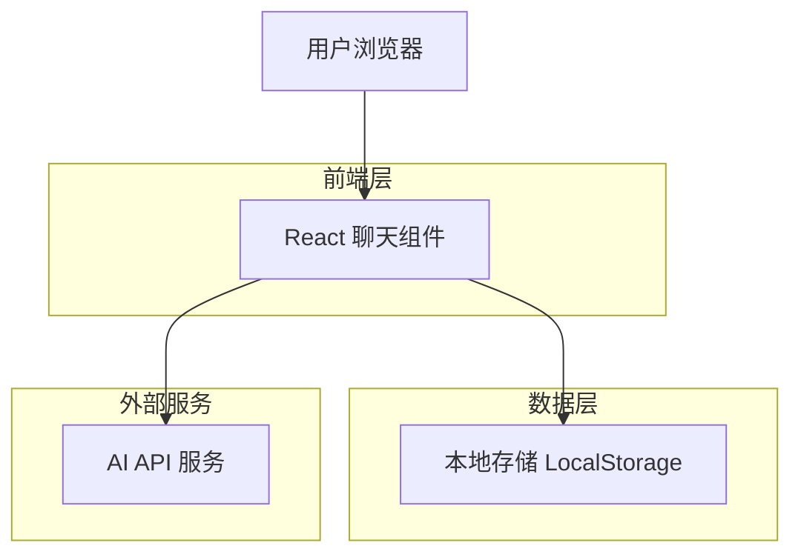
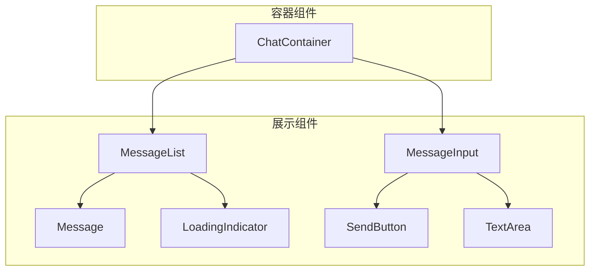
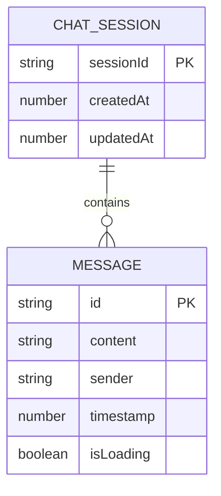

# AI 聊天框组件技术架构文档

## 1. Architecture design



## 2. Technology Description

* Frontend: React\@18 + TypeScript\@5 + TailwindCSS\@3 + Vite

* State Management: React Hooks (useState, useEffect, useCallback)

* Storage: LocalStorage for chat history

* Icons: Heroicons React

## 3. Route definitions

由于这是一个独立的聊天组件，不涉及路由系统。组件将作为可复用的 React 组件集成到其他应用中。

| Component     | Purpose            |
| ------------- | ------------------ |
| ChatContainer | 主聊天容器组件，管理整体布局和状态  |
| MessageList   | 消息列表组件，展示聊天历史      |
| MessageInput  | 消息输入组件，处理用户输入和发送   |
| Message       | 单条消息组件，区分用户和AI消息样式 |

## 4. API definitions

### 4.1 Core API

组件对外暴露的接口：

```typescript
interface ChatComponentProps {
  onSendMessage?: (message: string) => Promise<string>;
  initialMessages?: Message[];
  placeholder?: string;
  className?: string;
  maxHeight?: string;
}

interface Message {
  id: string;
  content: string;
  sender: 'user' | 'ai';
  timestamp: number;
  isLoading?: boolean;
}

interface ChatState {
  messages: Message[];
  isLoading: boolean;
  inputValue: string;
}
```

### 4.2 Internal Hooks

```typescript
// 聊天状态管理
const useChat = (initialMessages?: Message[]) => {
  // 返回消息列表、发送消息函数、清空历史等
};

// 本地存储管理
const useLocalStorage = <T>(key: string, initialValue: T) => {
  // 返回存储值和更新函数
};

// 自动滚动管理
const useAutoScroll = (dependency: any[]) => {
  // 自动滚动到底部
};
```

## 5. Component Architecture



## 6. Data model

### 6.1 Data model definition



### 6.2 TypeScript Type Definitions

```typescript
// 消息类型定义
export interface Message {
  id: string;
  content: string;
  sender: 'user' | 'ai';
  timestamp: number;
  isLoading?: boolean;
}

// 聊天会话类型
export interface ChatSession {
  sessionId: string;
  messages: Message[];
  createdAt: number;
  updatedAt: number;
}

// 组件属性类型
export interface ChatComponentProps {
  onSendMessage?: (message: string) => Promise<string>;
  initialMessages?: Message[];
  placeholder?: string;
  className?: string;
  maxHeight?: string;
  enableHistory?: boolean;
  theme?: 'light' | 'dark';
}

// 聊天钩子返回类型
export interface UseChatReturn {
  messages: Message[];
  sendMessage: (content: string) => Promise<void>;
  clearHistory: () => void;
  isLoading: boolean;
}

// 本地存储键名常量
export const STORAGE_KEYS = {
  CHAT_HISTORY: 'ai-chat-history',
  CHAT_SESSION: 'ai-chat-session'
} as const;
```

### 6.3 Local Storage Schema

```typescript
// LocalStorage 数据结构
interface StoredChatData {
  version: string; // 数据版本，用于迁移
  sessions: {
    [sessionId: string]: ChatSession;
  };
  currentSessionId: string;
  settings: {
    theme: 'light' | 'dark';
    enableHistory: boolean;
  };
}

// 默认存储数据
const DEFAULT_STORAGE_DATA: StoredChatData = {
  version: '1.0.0',
  sessions: {},
  currentSessionId: '',
  settings: {
    theme: 'light',
    enableHistory: true
  }
};
```

