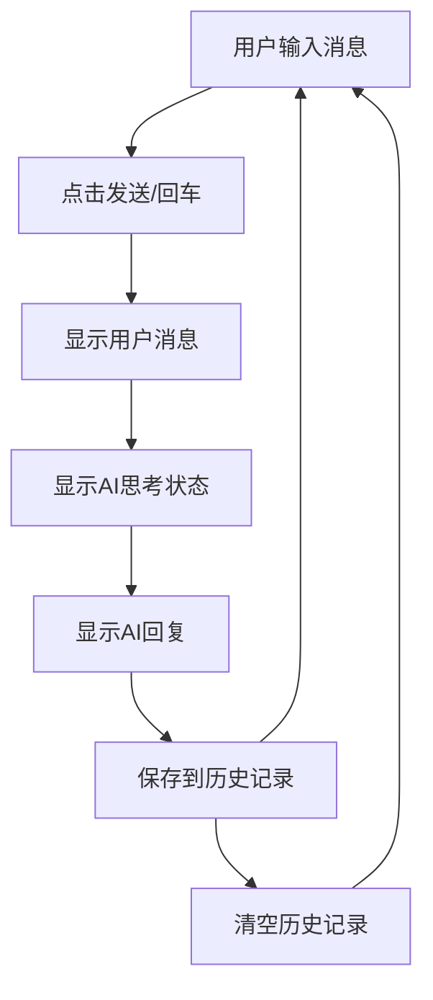

# AI 聊天框组件产品需求文档

## 1. Product Overview

本项目旨在开发一个基于 React + TypeScript + TailwindCSS 的现代化 AI 聊天框组件，为用户提供流畅的人机对话体验。

该组件将作为可复用的 UI 组件，支持集成到各种 Web 应用中，提供智能对话功能和优雅的用户界面。

## 2. Core Features

### 2.1 Feature Module

我们的 AI 聊天框组件包含以下核心页面：

1. **聊天界面**：消息显示区域、消息输入框、发送按钮、历史记录管理

### 2.2 Page Details

| Page Name | Module Name | Feature description                    |
| --------- | ----------- | -------------------------------------- |
| 聊天界面      | 消息显示区域      | 展示用户消息和AI回复，支持消息类型区分显示，包含头像、时间戳、消息气泡样式 |
| 聊天界面      | 消息输入框       | 支持多行文本输入，自动调整高度，支持回车发送和Shift+回车换行      |
| 聊天界面      | 发送按钮        | 触发消息发送，支持加载状态显示，禁用状态管理                 |
| 聊天界面      | 历史记录管理      | 本地存储聊天记录，支持清空历史，消息持久化                  |
| 聊天界面      | 响应式布局       | 适配桌面端和移动端，优化不同屏幕尺寸下的显示效果               |
| 聊天界面      | 动画效果        | 消息出现动画，输入状态指示，平滑滚动效果                   |

## 3. Core Process

用户操作流程：

1. 用户在输入框中输入消息内容
2. 点击发送按钮或按回车键发送消息
3. 用户消息立即显示在聊天区域
4. 系统显示AI思考状态（加载动画）
5. AI回复消息逐步显示在聊天区域
6. 消息自动保存到本地历史记录
7. 用户可以继续发送新消息或清空历史记录

## 4. User Interface Design

### 4.1 Design Style

* **主色调**：蓝色系 (#3B82F6) 作为主色，灰色系 (#6B7280) 作为辅助色

* **按钮样式**：圆角按钮，支持悬停和点击状态变化

* **字体**：系统默认字体栈，消息内容 14px，界面元素 12-16px

* **布局风格**：卡片式设计，顶部导航，消息气泡布局

* **图标风格**：使用 Heroicons 或类似的线性图标库

### 4.2 Page Design Overview

| Page Name | Module Name | UI Elements                            |
| --------- | ----------- | -------------------------------------- |
| 聊天界面      | 消息显示区域      | 白色背景，用户消息右对齐蓝色气泡，AI消息左对齐灰色气泡，圆角设计，阴影效果 |
| 聊天界面      | 消息输入框       | 白色背景，圆角边框，focus状态蓝色边框，placeholder提示文字  |
| 聊天界面      | 发送按钮        | 蓝色背景，白色图标，圆形按钮，悬停时颜色加深，禁用时灰色           |
| 聊天界面      | 历史记录管理      | 顶部工具栏，清空按钮，确认对话框                       |

### 4.3 Responsiveness

组件采用移动优先的响应式设计：

* 移动端（<768px）：单列布局，消息气泡最大宽度80%

* 平板端（768px-1024px）：适中间距，消息气泡最大宽度70%

* 桌面端（>1024px）：宽松布局，消息气泡最大宽度60%

* 支持触摸交互优化，按钮和输入框适配触摸操作

